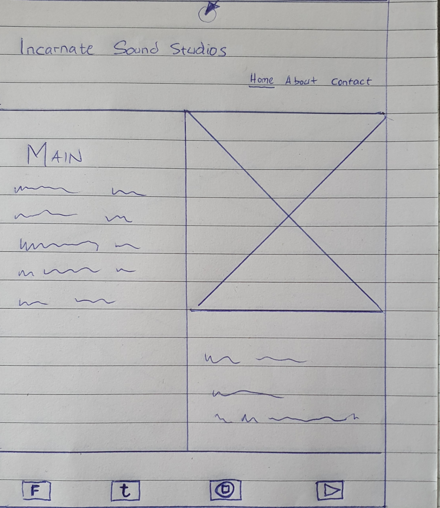
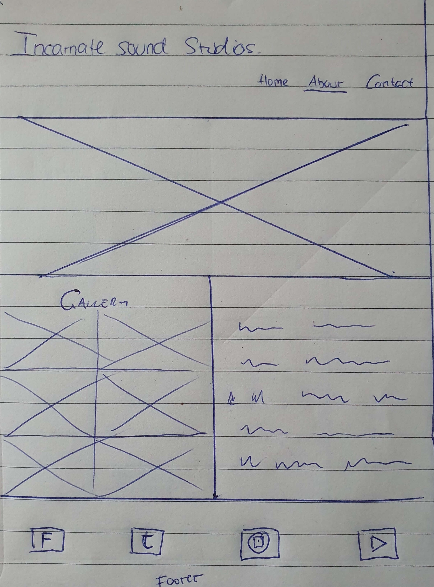
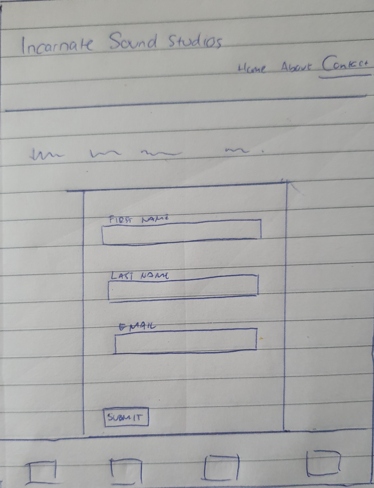

# Incarnate Sound Studios

Incarnate Sound Studios is a website presenting a local recording studio in Kristianstad, Sweden. The goal of the site is to direct aspiring musicians to the studio and provide different services e. g. tracking instruments and vocals as well as mixing and mastering of songs. The site displays what kind of services that are available to the client and how to get in touch. There's also a list of gear and musical tools that the client will have access to during booked sessions. The live site can be visited via this link.

## Site goals

The prime goal from a business standpoint, is to make musicians, artists and performers aware of the access to a local recording studio. Providing high-end results while still maintaining lower prices is also a focal point, to let artists on a budget have access to modern recording options. 

## What the user can expect

* An informative website, providing all necessary information about the studio including location, services, contact details and pricing.
* Links to social media platforms.
* Complete list of both outboard gear and virtual tools.
* Coffee is included in all booked sessions.
* Easy navigation and full responiveness with all devices.
  
## Design 

The design of the website has the goal to inspire the user to be creative with their craft. The visitor should feel that the clean look and clear messages on the site are inviting and friendly, as well as professional. As a working or aspiring musician, You should feel that You are welcomed into an anvironment that lets You create freely and comfortably. 

### Choice of colours

A careful choice of colours have been used to provide maximum accessibility, while maintaining the professional feel of the website. The user can enjoy an experience which is smooth on the eye and also clearly displays the message of the site. When clicking on the links, the user will feel that You are still on the same site, so the colour palette is homogenous and balanced.

### Choice of fonts

Some clean sans-serif fonts were used to provide a readable text. The choice of these fonts was based on the goal to provide maximum readability and a professional feel. More ecclectic fonts may sometimes confuse a user or provide a less serious feel.

## Wireframes

The wireframes produced with Balsamiq.

The wireframes from paper:

## Features

* Navigation

* Landing page
* About section
* Contact form section
* Footer
* Features left to implement

## Testing
### Validator testing
*HTML
No errors were returned when running the code through the W3C Markup Validator.
*CSS
No errors were returned when running the code through the W3C CSS Validator.
*Accessibility
The site achieved a Lighthouse accessibility score of 100% which assures that the choice of colours and fonts are easy to read and access. 
### Form testing
*The form was tested to ensure that no submission will happen without the required input fields being filled in by the user.
### Links testing
*All links have been tested to ensure that the correct section of the wesite will open when the user clicks the links. 
*Social media links have been tested to ensure that the user will be directed to the correct site and that the link will open in a new tab.
### Browser testing
*The site was tested with Google Chrome,
### Device testing
*
### User testing
*
### Fixed bugs
#### 
*
### Known bugs

 # Techologies used
 ## Languages
*HTML
*CSS
## Frameworks - Libraries - Programs Used
- [Am I Responsive](http://ami.responsivedesign.is/) - Main tool for testing responsiveness of the site on different devices.
- [Responsinator](http://www.responsinator.com/) - Alternative tool for testing responsiveness of the site on different devices.
- [Balsamiq](https://balsamiq.com/) - Used to generate basic wireframe images.
- [Chrome Dev Tools](https://developer.chrome.com/docs/devtools/) - Used for development, element inspection and tweaking as well as testing of site.
- [Font Awesome](https://fontawesome.com/) - Provides all icons used in footer.
- [GitHub](https://github.com/) - For hosting and version control.
- [Google Fonts](https://fonts.google.com/) - Used to import additional fonts to the project.
- [TinyPNG](https://tinypng.com/) - To compress image files to reduce file size without losing quality.
- [W3C](https://www.w3.org/) - Used for HTML & CSS Validation.

# Deployment

# Credits

## Content

## Media

## Resources

# Acknowledgements
