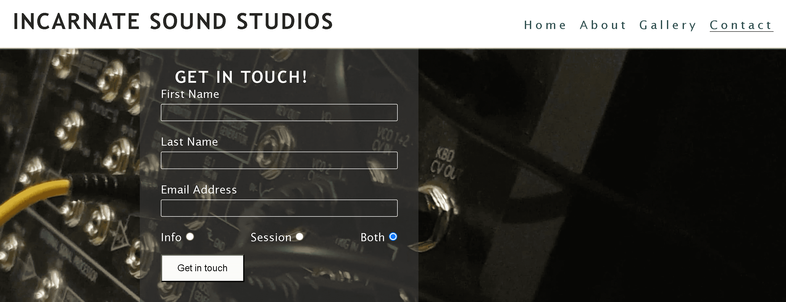
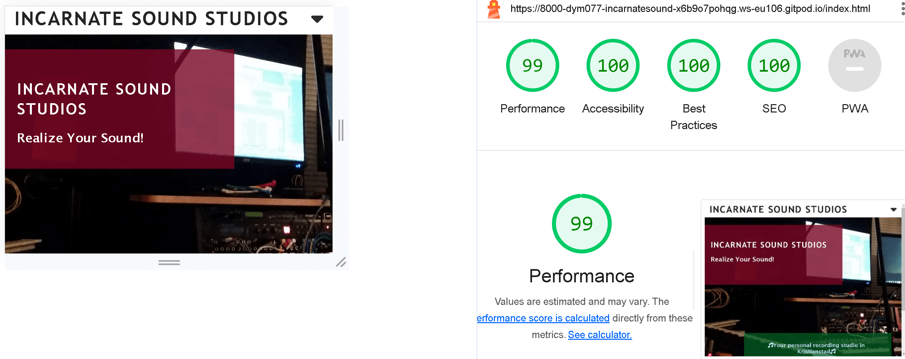
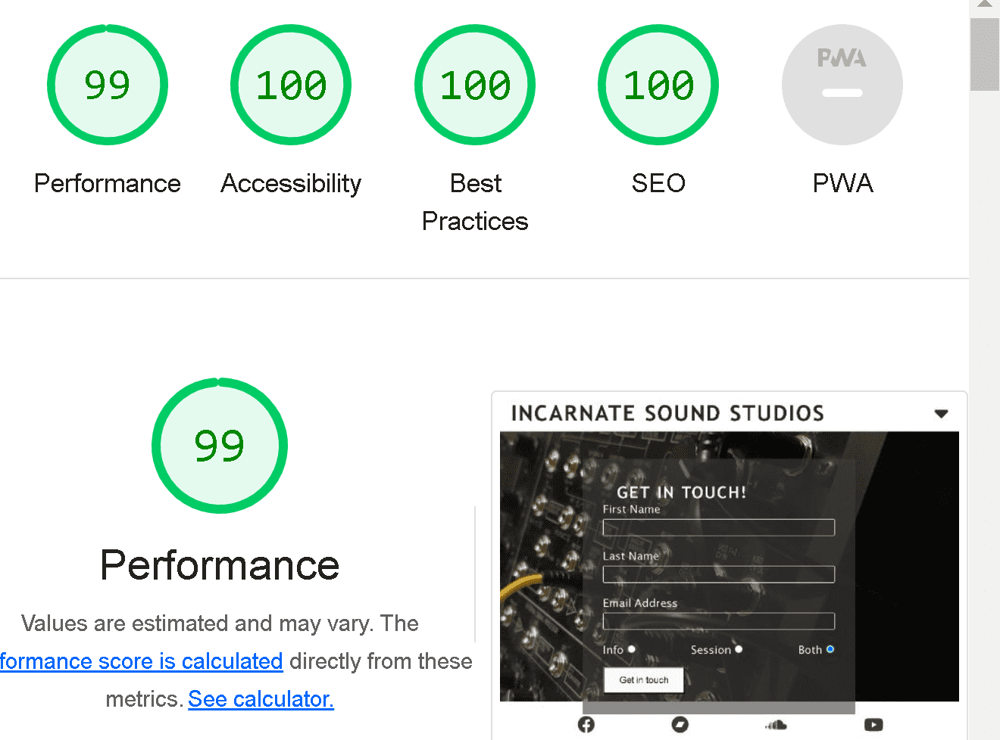

# Incarnate Sound Studios
- Incarnate Sound Studios is a website presenting a local recording studio in Kristianstad, Sweden. The goal of the site is to direct aspiring musicians to the studio and provide different services e. g. tracking instruments and vocals as well as mixing and mastering of songs. The site displays what kind of services that are available to the client and how to get in touch. There's also a list of gear and musical tools that the client will have access to during booked sessions. The live site can be visited via [this link.](https://dym077.github.io/Incarnatesound/index.html)

## Site goals

- The prime goal from a business standpoint, is to make musicians, artists and performers aware of the access to a local recording studio. Providing high-end results while still maintaining lower prices is also a focal point, to let artists on a budget have access to modern recording options. 

## What the user can expect

* An informative website, providing all necessary information about the studio including location, services, contact details and pricing.
* Links to social media platforms.
* Complete list of both outboard gear and virtual tools.
* Coffee is included in all booked sessions.
* Easy navigation and full responiveness with all devices.

## User Stories
### First time user
- A first time user should get all necessary info to make a decision if the sevices available on the site are sufficient and reliable and that he or she can get in touch, either to require further info or book a session. 
- A first time user will feel confident with the navigation on the page and can easily acquire the material provided. 
- A first time user will also be able to receive tips and tricks for their own projects, without utilizing the studio.
- A first time user will be able to follow the links in the footer to hear sound clips, watch videos and find useful information related to music recording and production.
### Returning user
- As a returning user You can receive valuable resources, both for Your own musical projects, as well as for Your instruments. 
- A returning user can receive sound libraries from the studio, as well as music and sound production techniques via e-mail. 
- As a returning user You can also follow the links in the footer to look for updates, listen to new music and find useful tips to boost Your own creativity.
### Frequent user
- A frequent user will be confident in finding all resources and navigating the page, as well as being aware of any updates or changes. 
- As a frequent user, You can engage in dialogue with the studio, sharing Your own successes and experiences. 
- A frequent user can sign up for a weekly newsletter with exclusive tips and tricks in recording music and sounds, as well as recommendations to other sources of information.
  
## Design 

- The design of the website has the goal to inspire the user to be creative with their craft. The visitor should feel that the clean look and clear messages on the site are inviting and friendly, as well as professional. As a working or aspiring musician, the user should feel that one is welcomed into an environment that lets You create freely and comfortably. 

### Choice of colours

- A careful palette of colours have been used to provide maximum accessibility, while maintaining the professional feel of the website. The user can enjoy an experience which is smooth on the eye and also clearly displays the message of the site. On the landing page, both green and red are used as background colours for the sections with text. The green resembles the soothing feeling You get when accomplishing Your goal, as well as indicating the project has been "greenlit". The red is a good complement to the green, and indicate both importance and a bit of urgency. It also suits the background well, given a slightly transparant character.

### Choice of fonts

- The site utilizes some well known sans-serif fonts. The choice of these fonts was based on the goal to provide maximum readability and a professional feel - more ecclectic fonts may sometimes confuse a user or provide a less serious feel. Fonts such as 'Lucida Sans', 'Lucida Sans Regular', 'Lucida Grande', 'Lucida Sans Unicode', Geneva and Verdana, sans-serif, are fonts which are very easily accessible and translates well on most devices and screens. 

## Wireframes

- The wireframes produced with Balsamiq.

- The wireframes from paper:

## Features

### Navigation

#### Landing page
- The landing page displays a panorama of the studio in a dim light, which provides an inspiring and welcoming feeling to the user. 

#### About section
- The About section is separated in two different sections:
- About Us, which gives a brief history of how the company was founded, as well as the location of the studio and the company's vision.
- The studio and the tools which are available to the client. 

#### Gallery section
- The gallery section displays the studio layout and the instruments and tools available.
- The gallery is displayed in columns which will respond to the screen size of the device used. 

#### Contact form section
- This section provdes an easy-to-fill-in form for the user to get in touch with the company. The user can choose either to receive information about the studio or to reach out to book a session or both. 

#### Footer
- The footer houses the social media links where the user can interact with the studio. The links available are for Facebook, Bandcamp, Youtube and Soundcloud and are opened in new tabs.

## Testing
### Validator testing
#### HTML
- No errors were returned when running the code through the W3C Markup Validator.
#### CSS
- No errors were returned when running the code through the W3C CSS Validator. 
- Accessibility
The site achieved a Lighthouse accessibility score of 100% which assures that the choice of colours and fonts are easy to read and access. 
### Form testing
- The form was tested to ensure that no submission will happen without the required input fields being filled in by the user.
### Links testing
- All links have been tested to ensure that the correct section of the wesite will open when the user clicks the links. 
- Social media links have been tested to ensure that the user will be directed to the correct site and that the link will open in a new tab.
### Browser testing
- The site was tested with Google Chrome, Microsoft Edge, Mozilla Firefox and Safari.
### Device testing
- The site has been tested with Chrome Developer Tools for its responsiveness on different devices, such as mobile phones, tablets, laptops and desktops. 
Lighthouse testing delivered the following results:

The following apps were also utilized to check the website on different screen-sizes:
- [Responsinator](http://www.responsinator.com/?url=https%3A%2F%2Fdym077.github.io%2FIncarnatesound%2F)
- [Am I Responsive?](https://ui.dev/amiresponsive?url=https://dym077.github.io/Incarnatesound/)

### User testing
- Friends and family members were asked to test and review the site on different devices to find any bugs or issues.
### Fixed bugs
#### 
* Fixed a problem where the margin of the header didn't adjust due to duplicats of the h2 element where values were overridden. 
### Known bugs
* The text "Get in touch" seems to be invisible on the "submit"-button with some iPhone models, such as iPhone 11 Pro.
 # Techologies used
 
 ## Languages
* HTML
* CSS
## Frameworks - Libraries - Programs Used
- [Am I Responsive](http://ami.responsivedesign.is/) - Main tool for testing responsiveness of the site on different devices.
- [Responsinator](http://www.responsinator.com/) - Alternative tool for testing responsiveness of the site on different devices.
- [Balsamiq](https://balsamiq.com/) - Used to generate basic wireframe images.
- [Chrome Dev Tools](https://developer.chrome.com/docs/devtools/) - Used for development, element inspection and tweaking as well as testing of site.
- [Font Awesome](https://fontawesome.com/) - Provides all icons used in footer.
- [GitHub](https://github.com/) - For hosting and version control.
- [Google Fonts](https://fonts.google.com/) - Used to import additional fonts to the project.
- [TinyPNG](https://tinypng.com/) - To compress image files to reduce file size without losing quality.
- [IloveIMG](https://www.iloveimg.com/) - Used to resize, convert and compress image files.
- [W3C](https://www.w3.org/) - Used for HTML & CSS Validation.
- [Convertio](https://convertio.co/jpg-webp/) - Used for conversion of images to webp format.

# Deployment
This project was deployed using GitHub. To access the website through GitHub, follow these steps:

1. Navigate to the repository on GitHub.com
2. Select 'Settings'.
3. Navigate to 'Pages' from the menu bar on the left of the page.
4. Find 'Branch' dropdown menu and select the main branch.
5. Select the main branch and click 'Save'.
6. Deployment should be confirmed by a message on a green background       saying "Your site is published at",  followed by the web address.

# Credits

## Content
The following web pages were visited for inspiration and tips:
- [Tilt Recordings](https://www.tiltrecordings.com/)
- [Helter Skelter ](https://www.helterskelter.se/?gclid=CjwKCAiAu9yqBhBmEiwAHTx5pzoU7M2d8jGHaMvvH9QWvuFrVPB_RPfqhCJtevS6EQIJA4ZnUDJpPhoC5JUQAvD_BwE)
- [Tropikal Studios](https://www.tropikal.se/?gclid=CjwKCAiAu9yqBhBmEiwAHTx5p6oyeOLfh9u9W-rQKU0iBmpBvZN8kkuRbbnTlPY9gJKhzNlH0oKkLhoC4jYQAvD_BwE)
- [Danmalschmusic.com](https://www.danmalschmusic.com/?gclid=CjwKCAiAu9yqBhBmEiwAHTx5pzDS6S-EzszcWTksEHfduZj_oMMiEPm-OADPqgFWfgN_G9aJCcqsChoCrukQAvD_BwE)
- [Soundmine Recording Studio](https://www.soundminerecordingstudio.com/about.html)
- [Nicelabs](https://www.nicelabs.at/)
## Media
- All visual media was from the creator's private image library.
## Resources
The following online resources were utilized to access additional information:
- [Stack overflow](https://stackoverflow.com/)
- [W3Schools](https://www.w3schools.com/)
- [CSS Tricks](https://css-tricks.com/)

# Acknowledgements
My mentor Antonio for all his support and useful advice.
The Code Institute Slack community which has been a very useful source of information and advice on coding and fixes. 
